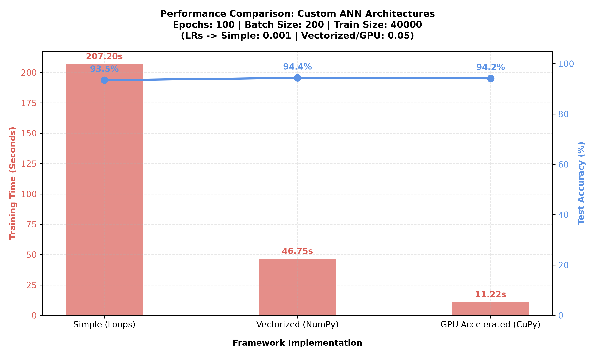

# Custom Neural Network from Scratch (NumPy)

This repository contains a clean, from-scratch implementation of an Artificial Neural Network (ANN) using Python and NumPy. The project is designed to explicitly showcase the mathematical foundations of deep learning—specifically forward propagation, weight initialization strategies, and backpropagation—without relying on heavy deep-learning frameworks like PyTorch or TensorFlow.

---

# Performance
The benchmark below demonstrates the performance execution across the different implementations using the **MNIST dataset** with a **$(784, 16, 16, 10)$** network architecture, utilizing **ReLU** activation for the hidden layers and **Sigmoid** activation for the final output layer:



---

## Features

* **Framework-Free Implementation:** Built entirely from scratch to expose the exact linear algebra and calculus mechanics powering deep neural networks.
* **Multi-Tiered Code Architecture:**
  * **Foundational (`NeuralNetworkSimple.py`):** Employs explicit loops and clean outer product calculations to transparently map the raw mathematics to code.
  * **Vectorized CPU (`NeuralNetwork.py`):** Fully matrix-vectorized mini-batch pipeline leveraging NumPy for streamlined hardware execution.
  * **GPU-Accelerated (`NeuralNetworksCuPy.py`):** A drop-in alternative utilizing CuPy and parallelized CUDA kernels for massive high-throughput processing.
* **Smart Parameter Initialization:** Dynamically handles weight scaling by applying **He Initialization** for ReLU-activated layers and **Xavier Initialization** for Sigmoid-activated layers to eliminate vanishing or exploding gradients.
* **Stable Stratified Splitting:** Includes a robust data-splitting utility that uses CRC32 hashing to guarantee perfectly reproducible and uncorrupted train/test distributions across dataset updates.

---

## Repository Structure

* **`src/NeuralNetworkSimple.py`**: The foundational implementation exposing the raw math, loops, and matrix transformations for clear understanding.
* **`src/NeuralNetwork.py`**: A fully optimized, vectorized version leveraging NumPy's advanced vectorization capabilities for speed.
* **`src/NeuralNetworksCuPy.py`**: A drop-in, highly parallelized alternative exploiting CuPy's GPU-accelerated vectorization.
* **`src/utilz.py`**: Custom data-preprocessing utilities including stable stratified splitting.
* **`src/test.py`**: Sandboxed environment testing the network on the MNIST dataset.

---

## Architecture & Mathematical Foundations

### 1. Layer and Weight Notation
The network treats weights as structured transformation matrices between layers. For any layer index $l$:

* The activation layer is represented as a vector $a^{(l)}$.
* The weight matrix $W^{(l)}$ connects layer $l$ to layer $l+1$. 
* To keep row-major operations natural, the matrix dimensions are defined as:

$$\text{Shape of } W^{(l)} = (n_{l+1}, n_l)$$

Where $n_{l+1}$ is the number of neurons in the destination layer, and $n_l$ is the number of neurons in the source layer. An individual weight element $W_{jk}^{(l)}$ maps the $k$-th neuron of layer $l$ to the $j$-th neuron of layer $l+1$.

---

### 2. Weight Initialization Strategies
To prevent gradients from exploding or vanishing during backpropagation, weights are automatically scaled down based on the incoming layer's size $n_{in}$ and the choice of activation function:

* **He Initialization** (Optimized for **ReLU**):
    Weights are sampled from a standard normal distribution and scaled by:
    $$\sigma = \sqrt{\frac{2.0}{n_{in}}}$$

* **Xavier Initialization** (Optimized for **Sigmoid**):
    Weights are sampled from a standard normal distribution and scaled by:
    $$\sigma = \sqrt{\frac{1.0}{n_{in}}}$$

---

### 3. Forward Propagation
For each layer, the net input vector $z^{(l)}$ is computed by mapping the previous layer's activations through the weight matrix and adding the bias vector $b^{(l)}$:

$$z^{(l)} = W^{(l-1)} a^{(l-1)} + b^{(l-1)}$$

The activation vector for the layer is then computed via the chosen non-linear activation function $f$:

$$a^{(l)} = f(z^{(l)})$$

The network natively handles a dedicated activation function for the hidden layers (e.g., ReLU) and a distinct one for the output layer (e.g., Sigmoid for probability distribution).

---

### 4. Backpropagation & Gradient Calculus
The network minimizes the Total Squared Error (Cost Function $C$) across the network predictions:

$$C = \sum (a^{(L)} - y)^2$$

Where $a^{(L)} is the final layer output prediction and $y$ is the one-hot encoded ground truth.

#### Output Layer Error ($\delta^{(L)}$)
The error gradient with respect to the output activation space is computed first:

$$\delta^{(L)} = \frac{\partial C}{\partial z^{(L)}} = 2(a^{(L)} - y) \odot f_L'(z^{(L)})$$

Where $\odot$ represents the element-wise Hadamard product, and $f_L'$ is the derivative of the final layer's activation function.

#### Error Backpropagation (Hidden Layers)
The error vector $\delta$ is recursively passed backward through the network layers from $l+1$ to $l$:

$$\delta^{(l)} = \left( (W^{(l)})^T \delta^{(l+1)} \right) \odot f'(z^{(l)})$$

#### Gradient Accumulation
Using these errors, the exact partial derivatives required to tune the biases and weights are derived via outer products ($\otimes$):

$$\frac{\partial C}{\partial b^{(l)}} = \delta^{(l+1)}$$

$$\frac{\partial C}{\partial W^{(l)}} = \delta^{(l+1)} \otimes a^{(l)}$$

### A Deeper Look: The Outer Product Equivalence

In the implementation (`NeuralNetworkSimple.py`), the weight gradient is computed using `np.outer(delta, self.layers[i-1])`. 
Mathematically, this elegant trick avoids nested loops by broadcasting the error vector across the activation states of the previous layer.

For any weight $W_{jk}^{(l)}$ connecting neuron $k in layer $l$ to neuron $j$ in layer $l+1$, the individual gradient is defined as:

$$\frac{\partial C}{\partial W_{jk}^{(l)}} = \delta_j^{(l+1)} \cdot a_k^{(l)}$$

If we look at this from a matrix operations perspective, calculating this for every single $j$ (rows) and $k$ (columns) is structurally equivalent to performing a matrix multiplication between a column vector and a row vector:

$$\frac{\partial C}{\partial W^{(l)}} = \delta^{(l+1)} (a^{(l)})^T$$

> **Implementation Intuition:** This is exactly what the code does. Instead of manually constructing a matching transformation matrix `temp` where each element holds the corresponding activation $a_k^{(l)}$ 
> and performing a traditional matrix dot product (`delta @ temp`), `np.outer()` takes the vector $\delta^{(l+1)}$ and multiplies it across the transposed activation vector $(a^{(l)})^T$ in a single, highly optimized step. 
> This instantly yields the complete gradient matrix matching the shape of $W^{(l)}$.

#### Optimization Update
Using Online Stochastic Gradient Descent (SGD), the network parameters update over a learning rate $\alpha$:

$$W^{(l)} \leftarrow W^{(l)} - \alpha \frac{\partial C}{\partial W^{(l)}}$$

$$b^{(l)} \leftarrow b^{(l)} - \alpha \frac{\partial C}{\partial b^{(l)}}$$

---

## Advanced Utilities

### Stable Stratified Splitting
Located inside `src/utilz.py`, the `train_test_split` function guarantees deterministic and perfectly distributed splits across data updates without random state drift. It creates a stable unique key combining the row index and the stratification column target, hashing it via Cyclic Redundancy Check (`crc32`):

$$\text{Condition for Test Set} = \left( \text{crc32}(\text{Target} \parallel \text{Index}) \ \& \ \text{0xffffffff} \right) < \text{ratio} \times 2^{32}$$

This ensures that even if new data rows are appended to the dataset, your training and testing sets remain structurally uncorrupted and reproducible.

---

## Vectorized Mini-Batch Implementation (`NeuralNetwork.py`)

To optimize processing speeds and fully leverage linear algebra hardware acceleration, the loops over individual rows are replaced with **full matrix vectorization**:

* **Matrix-Based Activations:** Layer activations are transformed into matrices of shape $(n_l, m)$, where $m$ represents the number of samples in a batch. To maintain clean mathematical consistency while adhering to the standard input layout $X = (\text{samples}, \text{features})$, the input matrix is transposed immediately upon entry so that $\text{layer}[0]$ matches the required $(\text{features}, \text{samples})$ structural shape.
* **Broadcasting Biases:** Biases are reshaped into 2D column vectors $(n_l, 1)$. This explicitly utilizes NumPy/CuPy broadcasting to automatically apply the bias vector across all sample columns simultaneously during the forward pass calculation: $z^{(l)} = W^{(l-1)} a^{(l-1)} + b^{(l-1)}$.
* **Batch Gradient Accumulation:** Given a backpropagated error matrix $\delta$ of shape $(\text{neurons}_{out}, \text{samples})$ and a previous layer activation matrix of shape $(\text{neurons}_{in}, \text{samples})$, the execution of `delta @ self.layers[i-1].T` sums up the total gradients across all batch samples in a single matrix multiplication step, populating the full weight gradient matrix.
* **Collapsing Bias Columns:** The cumulative bias gradient is isolated by collapsing sample columns via a summation across `axis=1`. The dimension integrity is preserved as a 2D column vector using `keepdims=True`.
* **Averaging Parameter Updates:** All accumulated weight and bias gradients are divided by the total batch sample count $m$ prior to applying the learning rate $\alpha$, maintaining a normalized gradient descent execution path across arbitrary batch sizes:

$$W^{(l)} \leftarrow W^{(l)} - \frac{\alpha}{m} \frac{\partial C}{\partial W^{(l)}}$$

$$b^{(l)} \leftarrow b^{(l)} - \frac{\alpha}{m} \frac{\partial C}{\partial b^{(l)}}$$

---

## GPU-Accelerated Execution via CuPy (`NeuralNetworksCuPy.py`)

For high-throughput environments, a parallelized GPU alternative is implemented using **CuPy**, acting as a drop-in replacement for the vectorized NumPy pipeline:

* **Seamless Array Conversions:** Interoperability is managed by automatically shifting incoming host CPU arrays into dedicated graphics memory devices using `cp.asarray()`.
* **Isolated Device Math:** All array manipulation, vector broadcasting, activation calculations, and backpropagation steps occur completely within parallelized CUDA hardware kernels.
* **Asynchronous Memory Access:** To prevent device locking and maintain clean pipeline separation, evaluation outputs are explicitly converted back to standard host CPU objects via the `.get()` method within host-facing calls like `predict_probabilities()`.

---

## Quick Start

### Installation
Ensure you have the base requirements installed:
```bash
pip install -r requirements.txt
```
⚠️ Optional GPU Requirement: If you want to utilize the GPU-accelerated framework variant (src/NeuralNetworksCuPy.py), you will need to install the cupy package matching your system's specific CUDA Toolkit version (e.g., pip install cupy-cuda12x). If you only intend to use the standard CPU vectorized version, no extra packages are necessary.

### Training the Model

To run the placeholder training sequence using the MNIST dataset:

* Place your mnist_train.csv dataset into a src/data/ directory.
* Run the pipeline script:
```bash
python -m src.temp
```